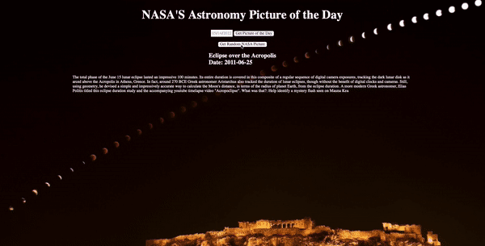

  

  
  
  
  
  

 <h1 align="center">Hi there👋, I'm Brendon!</h1>
<h3 align="center">A full stack software engineer from Raleigh, NC.</h3>

On any given day you can find me donning two hats: I'm a software engineer by day and a furniture flipper by night!

As a software engineer, I build full stack web applications for my clients. I have always had a keen interest in problem solving using technology and creating products from scratch and this combination led me to pursue a career in software engineering. 

Once the sun sets, you can find me nursing vintage furniture back to their glory days and finding them a new forever home where they will be loved. For every piece of furniture I rescue, it means one less piece at the landfill. My superpower is converting trash to treasure, what's yours? 

  

<h1 align="center">Projects</h1>
<table bordercolor="#66b2b2">
  
  <tr>
    <td width="50%" valign="top">
      <h3 align="center">Jeopard-ish!</h3>
         
        
         
        

          
    
  
      

        
Play a game of Jeopardy using this interactive game board, almost like the real deal!

    </td>
    <td width="50%" valign="top">
      <h3 align="center">NASA's Astronomy Picture of the Day</h3>
         
      
         
        

          
  
  
      

        
View NASA's Astronomy Picture of the Day either by selecting a date or clicking "Get random picture".

    </td>
  </tr>
  
  <tr>
    <td width="50%" valign="top">
      <h3 align="center">BrendonDsouza.com</h3>
       
        
       
        

  
  
      

        
Portfolio Site including links to my projects and ways to get in contact with me.

    </td>
    <td width="50%" valign="top">
      <h3 align="center">"That's What She Said"</h3>
         
        
         
        

          
  
  
      

        
View quotes from your favorite character from The Office (or click the random button!).

    </td>
  </tr>
</table>

<h1 align="center">Technologies</h1>

    
    
    
    
    
    
    
    
    
    
    
---

<h1 align="center">Let's Connect</h1>

  
  
  
  
  

